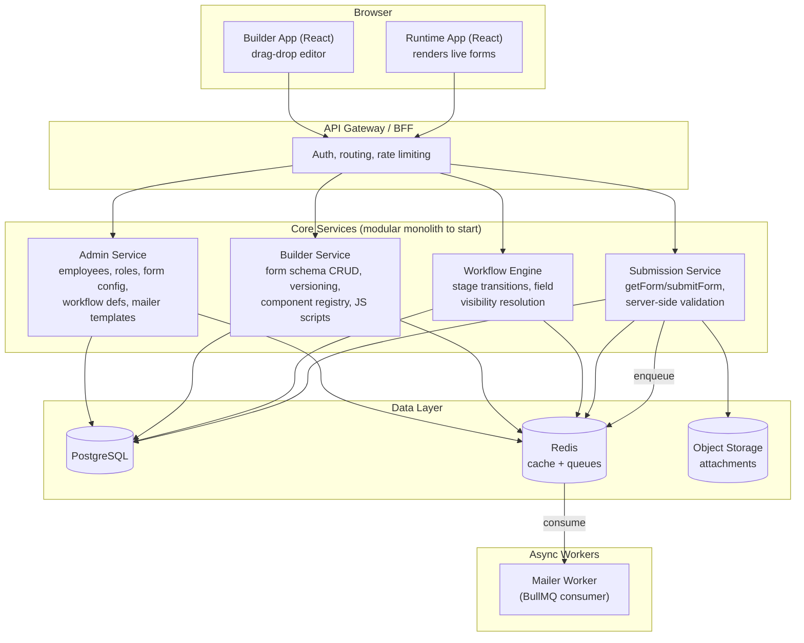

# System Design: Low-Code Application Builder Platform

**Stack:** PostgreSQL, Express/NestJS (Node), React, Redis, Docker, TypeScript

---

## 1. What this system actually is

Strip away the specific use cases (Helpdesk, Leave Application) and what you're building is a **dynamic-form + workflow engine**, where:

- **Admin** is the system of record — org data (employees, roles), form configuration, workflow definitions, mailer templates. Nothing here is hardcoded per-app.
- **Builder** is an *editor* that produces a JSON artifact (a form schema) — it doesn't run business logic itself.
- **Runtime** is the engine that takes `(form schema + workflow stage + user context)` and renders/executes the actual application an employee interacts with.

This is the same architecture pattern as Retool, Appsmith, ServiceNow Studio, or Frappe — a **schema-driven UI + state-machine workflow**, not a set of custom-coded apps. Once you build the engine correctly, "Helpdesk" and "Leave Application" become *data* (form schema + workflow definition), not new code.

---

## 2. High-Level Architecture



**Why a modular monolith and not microservices from day one:** you have four tightly-coupled domains (admin, builder, workflow, submission) that all read/write the same Postgres data and need transactional consistency (e.g., a submission + its workflow transition must commit together). Splitting these into separate deployable services now buys you nothing but network hops and distributed-transaction pain. Keep them as separate **modules with clean interfaces** inside one codebase/DB, and only extract a service when something has genuinely different scaling or deployment needs — the **Mailer Worker** is the one piece that's naturally async and belongs as a separate process from day one.

---

## 3. Core Modules

### 3.1 Admin Service — source of truth
- Employee/org data (or a synced read-model from an upstream HRMS)
- Form *configuration* (not the visual schema — things like which form applies to which department, ownership, permissions)
- Workflow definitions (stages, transitions, roles allowed per transition)
- Mailer templates (subject/body with placeholders)
- RBAC: who can build forms, who can approve at which stage

Admin is **write-master** for org/config data. Builder and Runtime always read it live or via cache — never duplicate it into their own tables, or you'll get drift.

### 3.2 Builder Service — the editor's backend
Persists what the drag-and-drop UI produces:
- `forms` (metadata: name, owner, status)
- `form_versions` (the actual component tree as JSONB, versioned, immutable once published)
- `js_scripts` (custom validation/event code, versioned, linted before save)
- `component_registry` (available component types: panel, textfield, button, attachment, dropdown, etc. — so the palette is data-driven too, letting you add new component types without a frontend release)

Builder never talks to end-users. It's an internal tool for whoever configures the Helpdesk/Leave forms.

### 3.3 Workflow Engine — the state machine
A workflow is a finite state machine per submission:
- `workflow_definitions`: stages, ordered, with role + field-visibility map per stage
- `workflow_instances`: one row per live submission — current stage, status
- `workflow_history`: full audit trail of every transition (who, when, from→to, action)

Its core job at runtime: **given a form schema + current stage + actor role, compute which fields are visible/editable/hidden.** This is the piece that answers your "which fields show in which stage" requirement — it's a merge operation, not something baked into the form schema itself, which is correct because the same form can be reused across workflows.

### 3.4 Submission Service — runtime data path
Handles the actual employee-facing read/write:
- `GET /runtime/forms/:formId/render` → merges form schema + workflow stage + role → single render payload for the frontend
- `POST /submissions` → the actual `getForm()`/submit target — persists data, re-validates server-side, advances the workflow instance, enqueues notifications

### 3.5 Mailer / Notification Worker
A separate Node process consuming a Redis-backed queue (BullMQ). Triggered by workflow transitions ("notify manager on submit", "notify employee on approval"). Decoupled so a slow SMTP call never blocks the submission request.

### 3.6 API Gateway / BFF
Single entry point handling auth (JWT/session), request routing to modules, rate limiting, and response shaping for the two frontends (Builder vs Runtime need different payloads).

---

## 4. Form Schema — what the drag-and-drop builder actually outputs

This JSON is the contract between Builder and Runtime. Keep it declarative wherever possible; JS should be the exception, not the default path for validation.

```json
{
  "formId": "leave-application",
  "version": 3,
  "status": "published",
  "components": [
    {
      "id": "comp_panel_1",
      "type": "panel",
      "layout": { "col": 12, "row": 1 },
      "children": [
        {
          "id": "comp_leaveType",
          "type": "dropdown",
          "bindingKey": "leaveType",
          "label": "Leave Type",
          "options": { "source": "static", "values": ["Sick", "Casual", "Earned"] },
          "validations": { "required": true }
        },
        {
          "id": "comp_days",
          "type": "textfield",
          "bindingKey": "numberOfDays",
          "label": "Number of Days",
          "validations": { "required": true, "type": "number", "min": 1, "max": 30 },
          "events": { "onBlur": "script_validateLeaveBalance" }
        },
        {
          "id": "comp_attachment",
          "type": "attachment",
          "bindingKey": "medicalCertificate",
          "label": "Medical Certificate",
          "visibilityRule": { "field": "leaveType", "equals": "Sick" },
          "validations": { "required": true, "maxSizeMB": 5, "allowedTypes": ["pdf", "jpg"] }
        },
        {
          "id": "comp_submit",
          "type": "button",
          "label": "Submit",
          "action": {
            "onClick": ["runScript:script_validateForm", "submitForm"]
          }
        }
      ]
    }
  ]
}
```

Key design choices baked in here:
- **`bindingKey`** decouples the visual component from the data field name — this is what maps into the submission payload and into workflow field-visibility rules.
- **`visibilityRule`** covers simple conditional logic *declaratively* (show attachment only if leaveType = Sick) — don't make people write JS for this, it's the majority case and declarative rules are safer, cacheable, and re-implementable server-side for validation.
- **`events`** reference a script *by ID*, not inline code — scripts are versioned separately in `js_scripts`, so you can lint/scan/audit them independently of the form tree, and reuse one script across multiple fields/forms.
- Stage-based field visibility (draft vs manager-review) is **deliberately not in this schema** — see §5. The form schema describes structure; the workflow describes what's visible when. Merging them at render time keeps one form reusable across workflows.

---

## 5. Stage-driven field visibility (the Admin/Workflow → Builder handoff)

Workflow definition, owned by Admin:

```json
{
  "workflowId": "leave-approval-v1",
  "formId": "leave-application",
  "stages": [
    {
      "stageId": "draft",
      "role": "employee",
      "fields": {
        "leaveType": "editable",
        "numberOfDays": "editable",
        "medicalCertificate": "editable",
        "managerComment": "hidden"
      }
    },
    {
      "stageId": "manager_review",
      "role": "manager",
      "fields": {
        "leaveType": "readonly",
        "numberOfDays": "readonly",
        "medicalCertificate": "readonly",
        "managerComment": "editable"
      }
    }
  ],
  "transitions": [
    { "from": "draft", "to": "manager_review", "action": "submit", "notifyTemplate": "leave_submitted_to_manager" },
    { "from": "manager_review", "to": "approved", "action": "approve", "notifyTemplate": "leave_approved" },
    { "from": "manager_review", "to": "rejected", "action": "reject", "notifyTemplate": "leave_rejected" }
  ]
}
```

**Render-time merge algorithm** (in Workflow Engine, called by Submission Service before returning the render payload):

1. Fetch `form_versions.schema` for the form (from cache, fallback to DB).
2. Fetch `workflow_instance.current_stage` for this specific submission (or `draft` for a new one).
3. Fetch the stage's `fields` visibility map from the workflow definition.
4. Walk the component tree; for each component with a `bindingKey`, annotate it with `editable | readonly | hidden` from the map (default `hidden` if unspecified — fail closed).
5. Return the annotated tree to the frontend. The frontend never decides visibility itself — it just renders what it's told, which means a malicious/tampered client can't reveal fields it shouldn't see, and you have one place (server) to change stage rules.

---

## 6. Custom JS execution — the part that needs the most care

This is a real security surface: you're letting business users write and ship arbitrary JavaScript that runs in the context of an app handling employee PII. Get the isolation model right before this feature ships broadly.

### Recommended architecture: sandboxed iframe + postMessage contract

- Custom scripts execute inside `<iframe sandbox="allow-scripts">`, **not** in the main app's `window` context. This means the script has no access to cookies, localStorage, other tabs' state, or the parent DOM.
- The parent (Runtime app) exposes a narrow, explicit API via `postMessage`, and the sandboxed script only ever sees that API — never real browser globals it could abuse:

```
Parent → iframe:  { type: "INIT", context: { fields: {...}, stage: "draft", role: "employee" } }
iframe → Parent:  { type: "GET_FIELD", key: "numberOfDays" }
Parent → iframe:  { type: "FIELD_VALUE", key: "numberOfDays", value: 5 }
iframe → Parent:  { type: "SET_FIELD", key: "leaveBalanceWarning", value: "Exceeds balance" }
iframe → Parent:  { type: "VALIDATION_RESULT", valid: false, message: "Not enough leave balance" }
iframe → Parent:  { type: "SUBMIT_FORM" }
```

- User-authored code only ever calls a handful of allowed helper functions (`getField`, `setField`, `showAlert`, `blockSubmit`, `allowSubmit`) that the sandbox wrapper injects — it never gets raw `fetch`, `XMLHttpRequest`, or DOM access to the host page. Set a strict `Content-Security-Policy` on the iframe (`script-src 'self'`, no `unsafe-eval` needed since you're not eval-ing arbitrary strings in the parent context).

- **Lint/scan on save, in Builder Service:** reject scripts using disallowed globals (`document`, `window.top`, `fetch`, `XMLHttpRequest`, `eval`) via static analysis (e.g., an ESLint config with `no-restricted-globals` run server-side) before persisting to `js_scripts`. This is a second layer, not a replacement for the iframe sandbox.

### The non-negotiable part: never trust client-side validation alone

Client JS can be bypassed entirely — a user can call your submission API directly. So:

- **Declarative validations** (`required`, `type`, `min/max`, `maxSizeMB`, regex) defined in the form schema must be **re-executed server-side** in Submission Service before persisting, using the same schema. This is cheap because they're declarative — write one validator that walks the JSON schema and runs on both client and server.
- Custom JS business rules that are genuinely critical (e.g., "leave balance must be sufficient") should either:
  - be expressed as a declarative rule where possible (a small rules DSL beats JS for the common 80% of cases — safer, server-replayable, no sandbox needed), or
  - for the cases that truly need arbitrary logic, run the *same* script server-side in an isolated context (`isolated-vm` or `vm2`-successor in Node) as a second gate before accepting the submission.

Treat client JS as **UX** (fast feedback, better experience) and server-side validation as **the actual gate**. This single decision prevents an entire category of "field said valid, DB got garbage" and "user bypassed the alert and submitted anyway" bugs.

---

## 7. End-to-end submission flow

```
1. RuntimeUI requests render payload:
   GET /runtime/forms/leave-application/render?submissionId=new

2. Submission Service:
   - fetches form schema (Redis cache → Postgres fallback)
   - fetches/creates workflow_instance (stage = draft)
   - Workflow Engine merges schema + stage visibility (§5)
   - returns annotated component tree

3. RuntimeUI renders form. User fills fields.
   - onBlur on "numberOfDays" → sandboxed script runs → may set a warning field
   - onClick on Submit button → runs "validateForm" script (client-side pre-check)
     → collects field values into a payload → calls getForm()/submitForm()

4. POST /submissions
   body: { formId, formVersion, submissionId?, data: { leaveType, numberOfDays, ... } }

5. Submission Service:
   - re-validates payload against schema (server-side, authoritative)
   - if invalid → 422 with field-level errors
   - if valid → persists to `submissions` (JSONB data), commits in same transaction as
     the workflow_instance stage transition (draft → manager_review)
   - writes to workflow_history (audit)
   - enqueues a job on the mailer queue (Redis/BullMQ): "notify manager"
   - returns success + new stage

6. Mailer Worker (separate process) picks up the job, fetches template from Admin,
   renders placeholders, sends email — decoupled from the request/response cycle.
```

---

## 8. Database schema (PostgreSQL)

Use **JSONB for genuinely dynamic structures** (form trees, submission data) and **normalized columns for anything you need to query, filter, or join on** (status, owner, dates, foreign keys). Add GIN indexes on JSONB columns you'll filter by.

| Table | Key columns | Notes |
|---|---|---|
| `forms` | id, name, owner_id, status, current_version | metadata only |
| `form_versions` | id, form_id, version_no, schema (jsonb), published_at | immutable once published |
| `js_scripts` | id, form_id, name, code (text), version, lint_passed | code is versioned separately from the form tree |
| `component_registry` | id, type, default_props (jsonb), icon | drives the builder palette |
| `workflow_definitions` | id, form_id, name, stages (jsonb), transitions (jsonb) | or fully normalize into `workflow_stages` / `workflow_transitions` if you need to query per-stage often |
| `workflow_instances` | id, workflow_id, submission_id, current_stage, status | one per live submission |
| `workflow_history` | id, instance_id, from_stage, to_stage, action, actor_id, created_at | audit trail, append-only |
| `submissions` | id, form_id, form_version, submitted_by, data (jsonb), created_at, updated_at | GIN index on `data` for querying |
| `attachments` | id, submission_id, binding_key, file_url, uploaded_by | file_url points to S3/MinIO, not stored in Postgres |
| `audit_logs` | id, entity_type, entity_id, actor_id, diff (jsonb), created_at | schema/config changes, not just submissions |

---

## 9. API surface (representative, not exhaustive)

**Admin (existing, read by everything else)**
```
GET  /admin/employees/:id
GET  /admin/forms/:formId/config          # ownership/permissions, not the visual schema
GET  /admin/workflows/:workflowId
GET  /admin/mailer-templates/:id
```

**Builder**
```
POST /builder/forms                       # create draft
PUT  /builder/forms/:id                   # update component tree (draft only)
POST /builder/forms/:id/publish           # freeze version, invalidate cache
GET  /builder/forms/:id?version=          # fetch schema for editing/preview
POST /builder/scripts                     # save + lint custom JS
```

**Runtime / Submission**
```
GET  /runtime/forms/:formId/render?submissionId=
POST /submissions                         # getForm()/submitForm() target
POST /submissions/:id/transition          # approve/reject/etc — role-checked
GET  /submissions/:id
```

---

## 10. Redis usage patterns

| Use case | Pattern |
|---|---|
| Form schema cache | `form:{id}:v{version}` → JSON blob, invalidated on publish |
| Workflow definition cache | `workflow:{id}` → JSON, invalidated on admin update |
| Job queues | BullMQ: `mailer-queue`, `webhook-queue`, `audit-queue` — decouples slow I/O from request path |
| Rate limiting | sliding-window counters per user/IP on submission endpoints |
| Session/token store | if not using pure stateless JWT |
| Builder collaboration (optional, later) | Pub/Sub for "form X is being edited by Y" presence/locking |

Form schemas and workflow definitions are **read-heavy, write-rare** — this is a near-ideal caching case. Invalidate explicitly on publish/update rather than relying on TTL alone, so builders see their changes reflected immediately.

---

## 11. Tech stack summary

| Layer | Choice | Notes |
|---|---|---|
| Frontend (Builder) | React + TS, `dnd-kit` or `react-dnd` | drag-drop editor producing the JSON schema |
| Frontend (Runtime) | React + TS | schema-driven renderer, one generic `<ComponentRenderer>` that switches on `type` |
| Backend | Node + TypeScript, NestJS (or Express if you want less structure) | NestJS's module system maps naturally onto Admin/Builder/Workflow/Submission boundaries |
| DB | PostgreSQL | JSONB for dynamic schema/data, relational for everything else |
| Cache/Queue | Redis + BullMQ | caching + async job processing |
| Object storage | S3-compatible (MinIO for local/dev) | attachments, never through app servers directly — use presigned URLs |
| Containerization | Docker + docker-compose (dev), consider ECS/K8s later | see §12 |
| Sandbox | `iframe sandbox` (client) + `isolated-vm` (server, for critical script re-validation) | see §6 |

---

## 12. Deployment sketch (docker-compose, dev)

```yaml
services:
  postgres:
    image: postgres:16
    environment: [POSTGRES_DB=builder, POSTGRES_PASSWORD=***]
    volumes: ["pgdata:/var/lib/postgresql/data"]

  redis:
    image: redis:7

  minio:
    image: minio/minio
    command: server /data

  admin-service:
    build: ./services/admin
    depends_on: [postgres, redis]

  builder-service:
    build: ./services/builder
    depends_on: [postgres, redis]

  workflow-service:
    build: ./services/workflow
    depends_on: [postgres, redis]

  submission-service:
    build: ./services/submission
    depends_on: [postgres, redis, minio]

  mailer-worker:
    build: ./services/mailer-worker
    depends_on: [redis]

  gateway:
    build: ./gateway
    ports: ["8080:8080"]
    depends_on: [admin-service, builder-service, workflow-service, submission-service]

  builder-ui:
    build: ./apps/builder-ui
    ports: ["3000:3000"]

  runtime-ui:
    build: ./apps/runtime-ui
    ports: ["3001:3001"]
```

If you're starting as a modular monolith (recommended, §2), collapse `admin-service` / `builder-service` / `workflow-service` / `submission-service` into a single `core-api` container with internal module boundaries — keep `mailer-worker` separate since it's genuinely a different process type.

---

## 13. Security checklist specific to this system

- [ ] Custom JS runs in sandboxed iframe with a fixed postMessage API — no raw DOM/network access
- [ ] Static lint/scan on script save, rejecting disallowed globals
- [ ] Every declarative validation re-run server-side; server is the authoritative gate, not the client
- [ ] Field visibility computed server-side per request, not trusted from client state — fail closed (unspecified = hidden)
- [ ] RBAC checked at every workflow transition (can this role legally move this stage?)
- [ ] Presigned URLs for attachment upload/download; file type/size validated server-side, not just in the component config
- [ ] Full audit trail on both workflow transitions (`workflow_history`) and schema/config changes (`audit_logs`)
- [ ] CSP headers on both Builder and Runtime apps; extra-strict CSP on the script sandbox iframe
- [ ] Rate limiting on `/submissions` to prevent scripted abuse

---

## 14. Suggested build order

1. **Form schema + generic renderer** — get a static JSON schema rendering as a real form (panel/textfield/button/attachment), no builder UI yet, no JS, no workflow. Prove the renderer works.
2. **Drag-and-drop Builder UI** producing that same JSON schema — now non-technical users can create what you hand-wrote in step 1.
3. **Declarative validation** (required/type/min/max/regex) — client + server, shared logic.
4. **Workflow engine** — stages, transitions, server-side field-visibility merge. Wire Leave Application as the first real workflow.
5. **Submission persistence + audit trail.**
6. **Mailer worker** on transitions.
7. **Custom JS sandbox** — the highest-risk, highest-effort piece; build it last, once the declarative path already covers most cases, so JS is genuinely the escape hatch rather than the default.
8. **Second app (Helpdesk)** as a forcing function — if it requires new engine code rather than just new schema/workflow data, that's a signal your abstractions in steps 1–4 aren't generic enough yet.

---

*One structural bet worth naming explicitly: keeping the form schema (structure) and the workflow definition (stage/visibility/transitions) as two separate artifacts that get merged at render time — rather than baking stage logic into the form JSON — is what lets the same "Leave Application" form get reused across multiple workflows (e.g., a fast-track vs standard approval path) without duplicating the form itself. It costs one extra merge step at render time; it saves you from forking forms every time a workflow changes.*
